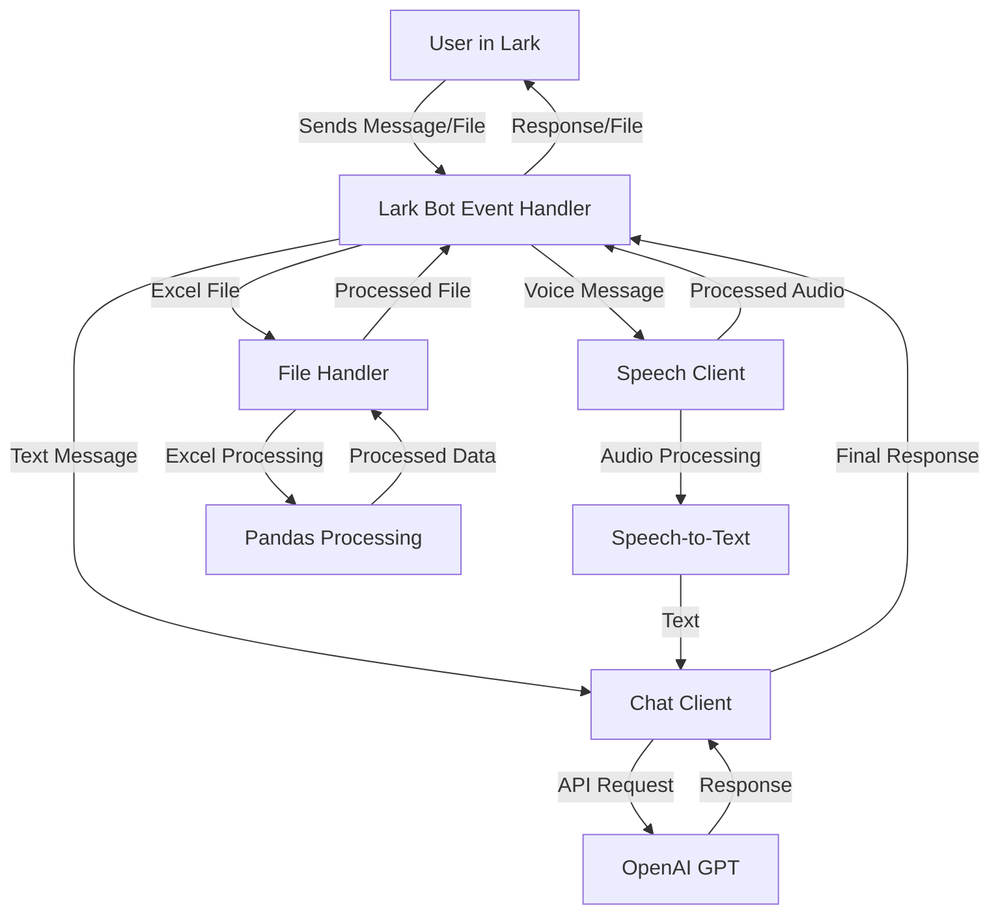

# Lark Intelligent Assistant Bot

## Overview
This is an intelligent assistant bot for Lark (Feishu) that integrates advanced AI capabilities with document processing features. The bot is designed to provide smart conversational interactions while handling various document formats, particularly Excel files.

## Key Features
- Advanced AI-powered conversations using OpenAI's GPT models
- Excel file processing and data extraction
- Speech-to-text capabilities
- Secure credential management
- Interactive chat interface in Lark

## Recent Implementations and Enhancements

### OpenAI Integration Updates
- Upgraded OpenAI package from ~0.28.1 to >=1.0.0
- Modernized chat client implementation with latest API standards
- Enhanced speech processing capabilities
- Implemented streaming responses for better user experience

### Security Improvements
- Removed hardcoded API keys and credentials
- Implemented environment variable based configuration
- Added secure .env file support
- Enhanced credential management system

### Excel Processing Capabilities
- Added new file handling module for Excel operations
- Implemented pandas integration for data processing
- Enhanced file upload and download capabilities
- Added support for various Excel operations (read, write, modify)

### Dependencies and Configuration
- Added new required packages:
  - pandas for data manipulation
  - python-dotenv for environment management
  - Updated OpenAI SDK
- Configured secure environment variable management

## Data Flow
```
User in Lark -> Webhook Event -> Django URL Router (/event/idea) 
                                      ↓
                              views_idea.event()
                                      ↓
                              broker.tackle_event()
                                      ↓
                    ┌─────────────────┴───────────────────┐
                    ↓                 ↓                   ↓
              OpenAI Client      Redis Cache          MySQL DB
                    │                 │                   │
                    └─────────────────┴───────────────────┘
                                      ↓
                              Response to User
```

## System Architecture



## Environment Setup
1. Clone the repository
2. Create a `.env` file with required credentials:
   ```
   OPENAI_API_KEY=your_openai_key
   LARK_APP_ID=your_lark_app_id
   LARK_APP_SECRET=your_lark_app_secret
   ```
3. Install dependencies:
   ```bash
   pip install -r requirements.txt
   ```

## Interaction Examples
1. Chat Interaction:
   - Send messages to get AI-powered responses
   - Voice messages are automatically transcribed and processed

2. Excel Operations:
   - Upload Excel files for processing
   - Request data analysis and modifications
   - Receive processed Excel files back

## Future Enhancements
- Enhanced Excel processing capabilities
- Advanced data visualization features
- Improved error handling and logging
- Extended file format support
- Integration with additional AI models

